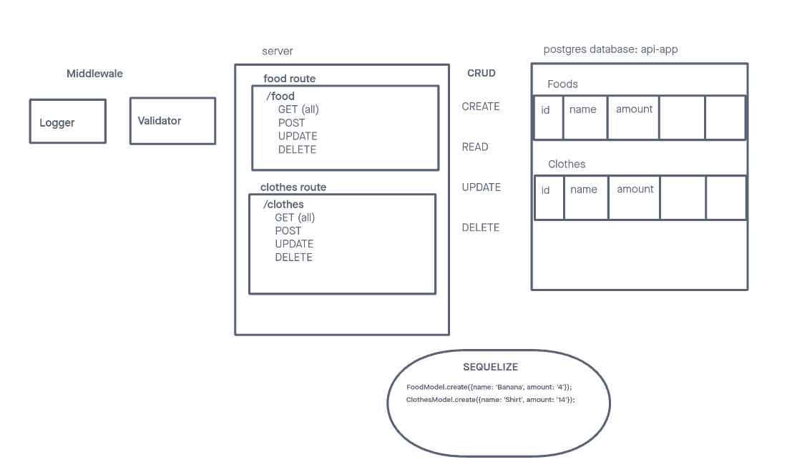

# LAB - 401-D49 Lab-03

## Project: basic-api-server

### Author: Lewis Benson

### Problem Domain

Phase 2 Requirements: Build a REST API using Express, by creating a proper series of endpoints that perform CRUD operations on a database, using the REST standard
Create 2 SQL data models using the Sequelize libary, make sure you export those model instances.
Make sure your Models are configured with your SQL dialect and can properly connect to your database.
Your models should have appropriate field names declared with specific sequelize DataTypes.

### Links and Resources

- [ci/cd](https://github.com/tm-LBenson/basic-api-server/actions) (GitHub Actions)
- [server-prod](https://four01-d49-basic-api.onrender.com/)

### Setup

#### `.env` requirements (where applicable)

see `.env.sample`

#### How to initialize/run your application (where applicable)

- nodemon

#### Features / Routes

- Feature one: Deploy to Prod

- GET : `/` - specific route to hit
- `/food` : GET, POST, UPDATE, DELETE
- `/clothes` : GET, POST, UPDATE, DELETE

-Feature two: Add tests

- Add tests for server
- Add tests for validator
- Add tests for logger

-Feature three: Add Logger

- Add logger.js to add a timestamp to the console when hitting endpoint
- Add validator to send an error when a name is not provided

#### Tests

- How do you run tests?
  - npm test
- Any tests of note?
  - handles root path
  - handles invalid paths
  - handles error code 500
- Describe any tests that you did not complete, skipped, etc

#### UML

Link to an image of the UML for your application and response to events
